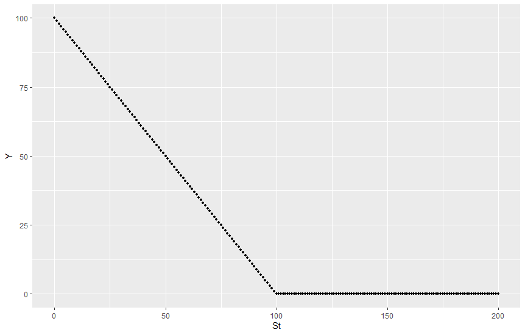
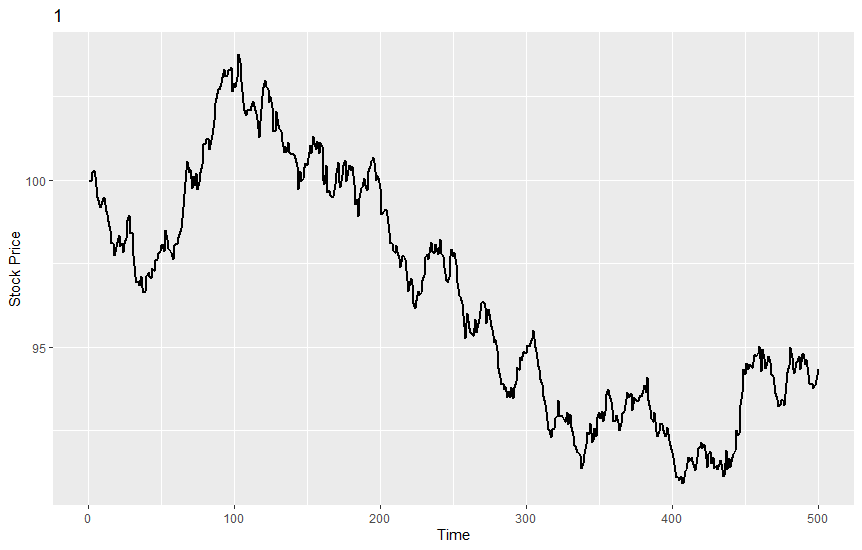
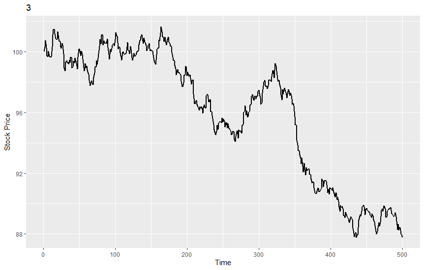
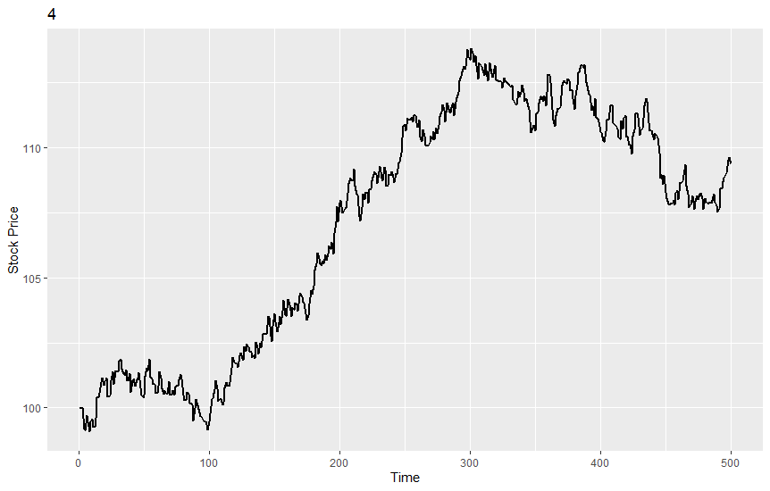
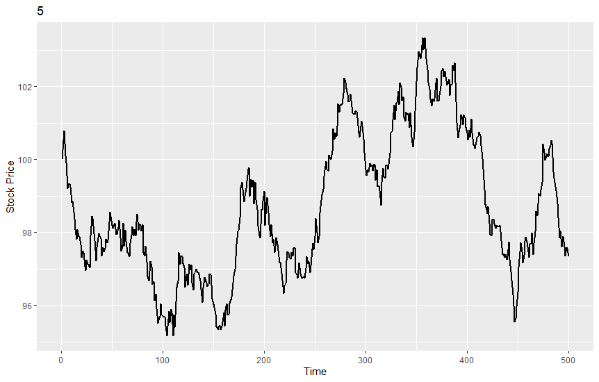

# R+Python 컴퓨팅: Homework 2

## 목차
1. [시뮬레이션을 통한 옵션 가격 결정](#1-시뮬레이션을-통한-옵션-가격-결정)  
1.1. [기준 자산 Y 그래프 출력](#11-기준-자산-y-그래프-출력)  
1.2. [옵션 가격 결정](#12-옵션-가격-결정)  
1.3. [주가 경로에 따른 옵션 가격 제시](#13-주가-경로에-따른-옵션-가격-제시)  
2. [K-means Clustering 알고리즘](#3-k-means-clustering-알고리즘)  

## 1. 시뮬레이션을 통한 옵션 가격 결정
### 1.1. 기준 자산 Y 그래프 출력
#### 1) 목표
만기에서의 콜 옵션 소유자의 수입 Y를 기준자산, 여기서는 주식 S<sub>T</sub>의 가격의 그래프로 나타내라.  
S<sub>T</sub>의 범위는 0부터 200까지이며 K=100으로 고정한다.  

|  |오늘의 현금 흐름|만기시의 수입|
|:------:|:------:|:------:|
|콜 옵션 소유자|-C|max(S<sub>T</sub>-K,0)|
|콜 옵션 발행자|+C|min(S<sub>T</sub>-K,0)|
#### 2) 수행 결과
먼저 함수를 정의한다.
```R
library('ggplot2')

question1<-function() {
  St<-c(0:200)
  k = 100
  Y = c()
  for (i in St){
    x <- c(i-k,0)
    Y <- append(max(x), Y)
  }
  df = data.frame(St, Y)
  qplot(St,Y, data=df, geom=c("point"))
  ggplot(data=df, aes(x=St, y=Y)) + geom_point(size=1) 
}
```
이후 위의 함수를 Source로 입력 받은뒤 실행한다.
다음 그래프는 위의 출력 결과로 나온 그래프 이다. 


### 1.2. 옵션 가격 결정
#### 1) 목표
노벨상을 수상한 블랙-숄즈-머턴은 이와 같은 콜옵션의 프리미엄 C 가 특정가정들을 만족한 경우 다음과 같은 식에 의해서 결정되어야 한다고 증명하였다.

#### C = S ∙ N(d<sub>1</sub>) - Ke<sup>-r<sub>f</sub>T</sup> ∙ N(d<sub>2</sub>)

|C:콜 옵션의 가격|S: 주식의 가격|K: 행사 가격|
|:------:|:------:|:------:|
| r<sub>f</sub> : 무 위험 이자울|T: 옵션의 만기|σ: 주식 수익률의 연간 표준 편차|
|N(d):  표준 정규 분포의 z-d까지의 누적 확률| | |
|d<sub>1</sub>=(ln(S/K) + (r<sub>f</sub> +(0.5*σ<sup>2</sup>))T) / (σ√T)| |d<sub>2</sub>=d<sub>1</sub>- σ√T|

여기서 S는 오늘의 주식 가격을 의미하고 e는 자연대수를 의미한다.  
따라서 오늘의 콜옵션가격은 오늘의 주가(S), 만기(T), 행사가격(K), 주식의 변동성 σ, 무위험 이자율 r<sub>f</sub>에 의해 결정된다.  
이 다섯가지 요소를 함수의 인자로 받고, 콜옵션 가격을 계산해주는 BSM 함수를 R로 코딩한 후, 
S=100, K=100, T=0.5, σ=0.1, r<sub>f</sub>=0.04에 대해 결과값을 계산하라. 

#### 2) 수행 결과
먼저 함수를 정의한다.
```R
BSM<-function(s, k, t, vol, rf) {
  x = vol * sqrt(t)
  d1 = (log(s/k)+(rf+(vol^2)/2)*t)/x
  d2 = d1 - x
  c = s*pnorm(d1)-k*exp(-(rf*t))*pnorm(d2)
  return(c)
}
```
위의 함수를 바탕으로 S=100, K=100, T=0.5, vol=0.1, rf=0.04로 입력하여 함수를 실행한다.
아래는 실행 결과이다.
```R
> source('~/BSM.R')
> c = BSM(s=100, k=100, t=0.5, vol=0.1, rf=0.04)
> print(c)
[1] 3.893411
```
### 1.3. 주가 경로에 따른 옵션 가격 제시
#### 1) 목표
재무 이론의 발전은 블랙 숄즈 머턴의 방법론과 동일한 결과를 다음과 같이 옵션만기 T시점까지 주가의 경로를 N번 시뮬레이션을 함으로써 얻을 수 있음을 확인하였다.  
여기서 i는 i번째 주가의 path를 의미하고 t는 0부터 만기 T까지의 시간 경로를 의미한다.  
주가의 경로를 0, 0+Δt, 0+2Δt,….. 0+MΔt, Δt=T/M 시점에 대해서 각각 산출한다는 의미이다.  
이와 같은 주가 S<sup>i</sup><sub>t</sub>에서 S<sup>i</sup><sub>t+∆t</sub>로의 경로식은 아래와 같이 주어진다. 

#### S<sup>i</sup><sub>t+∆t</sub> = S<sup>i</sup><sub>t</sub> * exp[(r-0.5σ<sup>2</sup>)∆t+ σ√∆t *ϵ<sup>i</sup><sub>t</sub>]
#### ϵ<sup>i</sup><sub>t</sub> ~ N(0,1)
이러한 i 번째 주가 경로에 대해서 만기시점의 옵션의 가치 V<sub>i</sub>는 다음과 같다.
#### V<sub>i</sub>=max(S<sup>i</sup><sub>t</sub>-K,0)
최종적으로 옵션의 가치 C는 다음과 같다.
#### C = exp(-r<sub>f</sub>T) * (1/N)∑<sup>N</sup><sub>(i=1)</sub>V<sub>i</sub>

Δt=1/1000, N=10000번으로 하여 Q2와 동일한 상황에서 옵션 가격을 계산한다.  
처음 다섯개의 주가 경로에 대해 오늘부터 만기까지(0->T) 꺽은선 형태의 그래프로 표기한다. 

#### 2) 수행 결과
먼저 함수를 작성한다.
```R
option<-function(s, k, t, vol, rf, dt, N){
  M = t/dt
  S <- matrix(0, nrow=N, ncol=M)
  V <- matrix(0, nrow=N, ncol=M)
  
  print("S & V matrix calculation start")
  for (i in 1:nrow(S)){
    for (j in 1:ncol(S)){
      if (j == 1){
        S[i, j] <- s
      }
      else {
        S[i, j] <- S[i, j-1]*exp((rf-0.5*(vol^2))*dt+ vol*sqrt(dt)*rnorm(1, 0, 1))
      }
      
      x = c((S[i, j]-k), 0)
      V[i, j] <- max(x)
    }
    if ((i %% 1000) == 0) {
      p = i/N*100
      cat(p, "% complete", "\n")
    }
  }
  print("S & V matrix calculation end\n")
  print("Get C value")
  C <- rowSums(V)
  C = C*exp(-(rf*t))/N
  C = mean(C[1])
  cat("C: ", C)
  
  return(S)
}
```
위의 함수를 이용하여 결과를 계산한다.
```
> source('~/option_final.R')
> S = option(s=100, k=100, t=0.5, vol=0.1, rf=0.04, dt=0.001, N=10000)
[1] "S & V matrix calculation start"
10 % complete 
20 % complete 
30 % complete 
40 % complete 
50 % complete 
60 % complete 
70 % complete 
80 % complete 
90 % complete 
100 % complete 
[1] "S & V matrix calculation end\n"
[1] "Get C value"
C:  0.0151721
```
이후 변환되 S(type:dataframe)을 바탕으로 최초 5개의 작업에 대하여 그래프를 그린다.  

먼저 함수를 정의한다.
```R
print_plot<-function(n, datas){
  for (i in 1:n){
    x <- 1:ncol(datas)
    y <- S[i, ]
    df = data.frame(x, y)
    plot <- ggplot(data=df, aes(x=x, y=y)) + geom_line(size=1) + labs(x="Time", y="Stock Price") + ggtitle(toString(i))
    print(plot)
  }
}
```
위의 함수에 n=5, datas=S로 하여 그래프 출력을 진행하면 다음과 같은 결과를 얻을 수 있다.





