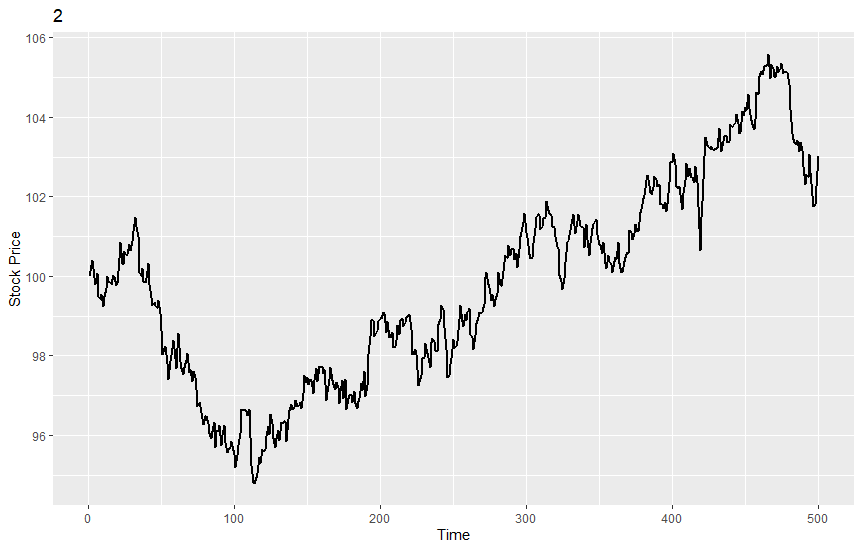
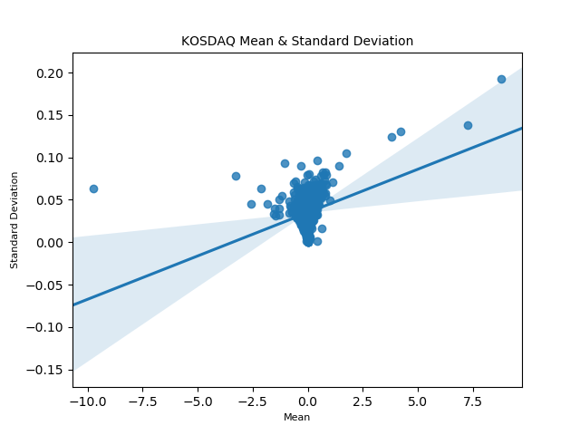

# R+Python 컴퓨팅: Final Report

## 목차
1. [시뮬레이션을 통한 옵션 가격 결정](#1-시뮬레이션을-통한-옵션-가격-결정)  
1.1. [기준 자산 Y 그래프 출력](#11-기준-자산-y-그래프-출력)  
1.2. [옵션 가격 결정](#12-옵션-가격-결정)  
1.3. [주가 경로에 따른 옵션 가격 제시](#13-주가-경로에-따른-옵션-가격-제시)  
2. [교수출제 기말과제 (개별과제 대체)](#2-교수출제-기말과제-개별과제-대체)  
2.1. [STEP 0](#21-step-0)  
2.2. [STEP 1](#22-step-1)  
2.3. [STEP 2](#23-step-2)   
2.4. [STEP 3](#24-step-3)  
3. [부록](#3-부록)  
3.1. [과제 1 소스코드](#31-과제-1-소스코드)  
3.2. [과제 2 소스코드](#32-과제-2-소스코드)  

## 0. 환경 세팅
만일 git을 사용하는 환경이라면 다음과 같은 cli명령어로 데이터를 확보 할 수 있다.
```
git clone https://github.com/94wogus/R_python_final.git
```

## 1. 시뮬레이션을 통한 옵션 가격 결정
### 1.1. 기준 자산 Y 그래프 출력
#### 1) 목표
만기에서의 콜 옵션 소유자의 수입 Y를 기준자산, 여기서는 주식 S<sub>T</sub>의 가격의 그래프로 나타내라.  
S<sub>T</sub>의 범위는 0부터 200까지이며 K=100으로 고정한다.  

|  |오늘의 현금 흐름|만기시의 수입|
|:------:|:------:|:------:|
|콜 옵션 소유자|-C|max(S<sub>T</sub>-K,0)|
|콜 옵션 발행자|+C|min(S<sub>T</sub>-K,0)|

#### 2) 수행 결과
먼저 함수를 정의한다.
```R
library('ggplot2')

question1<-function() {
  St<-c(0:200)
  k = 100
  Y = c()
  for (i in St){
    x <- c(i-k,0)
    Y <- append(max(x), Y)
  }
  df = data.frame(St, Y)
  qplot(St,Y, data=df, geom=c("point"))
  ggplot(data=df, aes(x=St, y=Y)) + geom_point(size=1) 
}
```
이후 위의 함수를 Source로 입력 받은뒤 실행한다.
다음 그래프는 위의 출력 결과로 나온 그래프 이다. 


### 1.2. 옵션 가격 결정
#### 1) 목표
노벨상을 수상한 블랙-숄즈-머턴은 이와 같은 콜옵션의 프리미엄 C 가 특정가정들을 만족한 경우 다음과 같은 식에 의해서 결정되어야 한다고 증명하였다.

#### C = S ∙ N(d<sub>1</sub>) - Ke<sup>-r<sub>f</sub>T</sup> ∙ N(d<sub>2</sub>)

|C:콜 옵션의 가격|S: 주식의 가격|K: 행사 가격|
|:------:|:------:|:------:|
| r<sub>f</sub> : 무 위험 이자울|T: 옵션의 만기|σ: 주식 수익률의 연간 표준 편차|
|N(d):  표준 정규 분포의 z-d까지의 누적 확률| | |
|d<sub>1</sub>=(ln(S/K) + (r<sub>f</sub> +(0.5*σ<sup>2</sup>))T) / (σ√T)| |d<sub>2</sub>=d<sub>1</sub>- σ√T|

여기서 S는 오늘의 주식 가격을 의미하고 e는 자연대수를 의미한다.  
따라서 오늘의 콜옵션가격은 오늘의 주가(S), 만기(T), 행사가격(K), 주식의 변동성 σ, 무위험 이자율 r<sub>f</sub>에 의해 결정된다.  
이 다섯가지 요소를 함수의 인자로 받고, 콜옵션 가격을 계산해주는 BSM 함수를 R로 코딩한 후, 
S=100, K=100, T=0.5, σ=0.1, r<sub>f</sub>=0.04에 대해 결과값을 계산하라. 

#### 2) 수행 결과
먼저 함수를 정의한다.
```R
BSM<-function(s, k, t, vol, rf) {
  x = vol * sqrt(t)
  d1 = (log(s/k)+(rf+(vol^2)/2)*t)/x
  d2 = d1 - x
  c = s*pnorm(d1)-k*exp(-(rf*t))*pnorm(d2)
  return(c)
}
```
위의 함수를 바탕으로 S=100, K=100, T=0.5, vol=0.1, rf=0.04로 입력하여 함수를 실행한다.
아래는 실행 결과이다.
```R
> source('~/BSM.R')
> c = BSM(s=100, k=100, t=0.5, vol=0.1, rf=0.04)
> print(c)
[1] 3.893411
```
### 1.3. 주가 경로에 따른 옵션 가격 제시
#### 1) 목표
재무 이론의 발전은 블랙 숄즈 머턴의 방법론과 동일한 결과를 다음과 같이 옵션만기 T시점까지 주가의 경로를 N번 시뮬레이션을 함으로써 얻을 수 있음을 확인하였다.  
여기서 i는 i번째 주가의 path를 의미하고 t는 0부터 만기 T까지의 시간 경로를 의미한다.  
주가의 경로를 0, 0+Δt, 0+2Δt,….. 0+MΔt, Δt=T/M 시점에 대해서 각각 산출한다는 의미이다.  
이와 같은 주가 S<sup>i</sup><sub>t</sub>에서 S<sup>i</sup><sub>t+∆t</sub>로의 경로식은 아래와 같이 주어진다. 

#### S<sup>i</sup><sub>t+∆t</sub> = S<sup>i</sup><sub>t</sub> * exp[(r-0.5σ<sup>2</sup>)∆t+ σ√∆t *ϵ<sup>i</sup><sub>t</sub>]
#### ϵ<sup>i</sup><sub>t</sub> ~ N(0,1)
이러한 i 번째 주가 경로에 대해서 만기시점의 옵션의 가치 V<sub>i</sub>는 다음과 같다.
#### V<sub>i</sub>=max(S<sup>i</sup><sub>t</sub>-K,0)
최종적으로 옵션의 가치 C는 다음과 같다.
#### C = exp(-r<sub>f</sub>T) * (1/N)∑<sup>N</sup><sub>(i=1)</sub>V<sub>i</sub>

Δt=1/1000, N=10000번으로 하여 Q2와 동일한 상황에서 옵션 가격을 계산한다.  
처음 다섯개의 주가 경로에 대해 오늘부터 만기까지(0->T) 꺽은선 형태의 그래프로 표기한다. 

#### 2) 수행 결과
먼저 함수를 작성한다.
```R
option<-function(s, k, t, vol, rf, dt, N){
  M = t/dt
  S <- matrix(0, nrow=N, ncol=M)
  V <- matrix(0, nrow=N, ncol=M)
  
  print("S & V matrix calculation start")
  for (i in 1:nrow(S)){
    for (j in 1:ncol(S)){
      if (j == 1){
        S[i, j] <- s
      }
      else {
        S[i, j] <- S[i, j-1]*exp((rf-0.5*(vol^2))*dt+ vol*sqrt(dt)*rnorm(1, 0, 1))
      }
      
      x = c((S[i, j]-k), 0)
      V[i, j] <- max(x)
    }
    if ((i %% 1000) == 0) {
      p = i/N*100
      cat(p, "% complete", "\n")
    }
  }
  print("S & V matrix calculation end\n")
  print("Get C value")
  C <- rowSums(V)
  C = C*exp(-(rf*t))/N
  C = mean(C[1])
  cat("C: ", C)
  
  return(S)
}
```
위의 함수를 이용하여 결과를 계산한다.
```
> source('~/option_final.R')
> S = option(s=100, k=100, t=0.5, vol=0.1, rf=0.04, dt=0.001, N=10000)
[1] "S & V matrix calculation start"
10 % complete 
20 % complete 
30 % complete 
40 % complete 
50 % complete 
60 % complete 
70 % complete 
80 % complete 
90 % complete 
100 % complete 
[1] "S & V matrix calculation end\n"
[1] "Get C value"
C:  0.0151721
```
이후 변환되 S(type:dataframe)을 바탕으로 최초 5개의 작업에 대하여 그래프를 그린다.  

먼저 함수를 정의한다.
```R
print_plot<-function(n, datas){
  for (i in 1:n){
    x <- 1:ncol(datas)
    y <- S[i, ]
    df = data.frame(x, y)
    plot <- ggplot(data=df, aes(x=x, y=y)) + geom_line(size=1) + labs(x="Time", y="Stock Price") + ggtitle(toString(i))
    print(plot)
  }
}
```
위의 함수에 n=5, datas=S로 하여 그래프 출력을 진행하면 다음과 같은 결과를 얻을 수 있다.




## 2. 교수출제 기말과제 (개별과제 대체)
### 2.1. STEP 0
#### 1) 목표
a)	KOSPI와 KOSDAQ 그룹에 대해서 각각 몇 개의 상장사가 있는지 확인한다. 
b)	KOSPI라는 list로 df_KOSPI의 Symbol값들을 저장하고, KOSDAQ이라는 이름으로 df_KOSPI의 Symbol값들을 저장한다.

#### 2) 수행 결과
먼저 환경 세팅을 진행한다.

```
python3 -m venv venv
pip install -U pip
pip install -U setuptools
pip install -r requirements.txt -U
```

먼저 KOSPI의 상장 데이터를 데이터 프레임으로 만든다.
이후 Symbol 값을 list로 저장후 갯수를 출력한다.

```python
import FinanceDataReader as fdr
# KOSPI
index = 'KOSPI'
df_KOSPI = fdr.StockListing(index)
KOSPI = list(df_KOSPI['Symbol'])
print(df_KOSPI.head())
print("{} 상장 회사 수: {}".format(index, len(KOSPI)))
```

```shell script
   Symbol   Name         Sector                                           Industry
0  155660    DSR    1차 비철금속 제조업                                             합섬섬유로프
1  001250  GS글로벌      상품 종합 도매업  수출입업(시멘트,철강금속,전기전자,섬유,기계화학),상품중개,광업,채석업/하수처리 서...
2  082740  HSD엔진  일반 목적용 기계 제조업                                     대형선박용엔진,내연발전엔진
3  011070  LG이노텍       전자부품 제조업                                        기타 전자부품 제조업
4  010060    OCI    기초 화학물질 제조업   타르제품,카본블랙,무수프탈산,농약원제,석탄화학제품,정밀화학제품,플라스틱창호재 제조,판매
KOSPI 상장 회사 수: 799
```

마찬가지 방법으로 KOSDAQ에 대하여 진행한다.

```python
# KOSDAQ
index = 'KOSDAQ'
df_KOSDAQ = fdr.StockListing(index)
KOSDAQ = list(df_KOSDAQ['Symbol'])
print(df_KOSDAQ.head())
print("{} 상장 회사 수: {}".format(index, len(KOSDAQ)))
```

```shell script
   Symbol     Name          Sector             Industry
0  051500  CJ프레시웨이  음·식료품 및 담배 도매업          식자재유통, 단체급식
1  083660  CSA 코스믹      플라스틱제품 제조업    물탱크,상하수도용도류벽,축산탱크
2  130500    GH신소재     기타 섬유제품 제조업    자동차용 부직포, 폴리우레탄 폼
3  083450      GST   특수 목적용 기계 제조업  GasScrubber,Chiller
4  067290     JW신약         의약품 제조업         매니큐어세트, 손톱깎이
KOSDAQ 상장 회사 수: 1400
```

### 2.2. STEP 1
#### 1-1) 목표
) 삼성전자에 대한 주식 종목 코드를 찾는다. 이후 fdr.DataReader 메소드를 사용하여 자료를 받은후에 각 날짜에 대한 일별 주가 수익률을 꺽은선 그래프 형태로 그려본다.
#### 1-2) 수행 결과

```python
# 삼성전자 주가 그래프 얻기
SamSung_electronic = df_KOSPI[df_KOSPI['Name'] == "삼성전자"]
print(SamSung_electronic)
print('\n')
df_SamSung_electronic = fdr.DataReader(SamSung_electronic['Symbol'].values[0], '2018-01-01', '2018-03-30')
print(df_SamSung_electronic)
# 수익률은 (금일 종가 - 전일 종가) / 전일 종가 * 100 으로 dataframe의 change * 100이다.
change_SamSung = df_SamSung_electronic['Change'] * 100
print(change_SamSung.head())
```

```shell script
     Symbol  Name          Sector                                           Industry
354  005930  삼성전자  통신 및 방송 장비 제조업  IMT2000 서비스용 동기식 기지국,교환국장비,데이터단말기,동영상휴대폰,핵심칩,반...


             Open   High    Low  Close  Volume    Change
Date
2018-01-02  51380  51400  50780  51020  169485  0.001177
2018-01-03  52540  52560  51420  51620  200270  0.011760
2018-01-04  52120  52180  50640  51080  233909 -0.010461
2018-01-05  51300  52120  51200  52120  189623  0.020360
2018-01-08  52400  52520  51500  52020  167673 -0.001919
...           ...    ...    ...    ...     ...       ...
2018-03-26  49420  50280  49040  50280  201155  0.011263
2018-03-27  50320  50460  49080  49980  237480 -0.005967
2018-03-28  49100  49100  48340  48700  303189 -0.025610
2018-03-29  48700  49560  48320  49040  201340  0.006982
2018-03-30  49080  49900  49080  49220  155542  0.003670

[61 rows x 6 columns]
Date
2018-01-02    0.117739
2018-01-03    1.176009
2018-01-04   -1.046106
2018-01-05    2.036022
2018-01-08   -0.191865
Name: Change, dtype: float64
```

```python
import matplotlib.pyplot as plt
import matplotlib.dates as mdates
plt.rcParams["figure.figsize"] = (18, 12)
plt.rcParams['lines.linewidth'] = 2
plt.rcParams['axes.grid'] = True
plt.gca().xaxis.set_major_formatter(mdates.DateFormatter('%Y-%m-%d'))
change_SamSung.plot()
plt.savefig('./static/change.png')
```


#### 2-1) 목표
KOSDAQ과 KOSPI에서 거래되는 전체 기업들에 대해서 각각 일별 수익률의 연간 평균과 표준편차를 구해본다.   
전체기업들에 대해 평균수익률-표준편차의 산포도를 그려본다.   
이러한 산포도를 KOSPI에 상장된 기업과 KOSDAQ에 상장된 기업에 대해 구분해서 각각 산포도를 그려본다.  
이 두 변수간의 양의 관계가 있는가?   
평균수익률은 일종의 사람들이 기대하는 수익률과 밀접한 관련이 있으며,   
주가수익률의 표준편차가 클수록 일반적으로 수익률의 리스크(위험도)가 크다고 생각한다. 
#### 2-2) 수행 결과
먼저 KOSPI 기업에 대하여 수행을 하였다.
위에서 만들어 놓은 KOSPI Symbol 리스트를 바탕으로 반복분을 진행하였다. 
반복문 내부에서 Symbol에 따른 평균 및 표준 편차를 바탕으로 DataFrame를 만들고 이를 바탕으로 그래프를 출력하였다. 
regulation을 위해서 seaborn 라이브러리를 활용하였다.

```python
# KOSPI 기업의 연간 평균과 표준편차
import pandas as pd
import seaborn as sns
import math
import os

if os.path.isfile("./KOSPI.csv"):
    KOSPI_mean_var = pd.read_csv("./KOSPI.csv")
else:
    KOSPI_mean_var = pd.DataFrame(columns=["mean", "std"])
    total = len(KOSPI)
    for x, s in enumerate(KOSPI):
        df = fdr.DataReader(s, '2018-01-01', '2018-12-31')
        mean = df['Change'].mean() * 100
        var = df['Change'].var()
        std = math.sqrt(var)
        KOSPI_mean_var.loc[s] = [mean, std]
        if x%50 == 0:
            print("{}/{} 개 완료".format(x, total))
    KOSPI_mean_var.to_csv("./KOSPI.csv", mode='w')

sns.regplot(
    x=KOSPI_mean_var['mean'],
    y=KOSPI_mean_var['std'],
    fit_reg=True
)
plt.title('KOSPI Mean & Standard Deviation', fontsize=10)
plt.xlabel('Mean', fontsize=8)
plt.ylabel('Standard Deviation', fontsize=8)
plt.savefig("./static/KOSPI.png")
plt.show()
```

이에 다음과 같은 그래프를 얻을 수 있었다.


```python
# KOSDAQ 기업의 연간 평균과 표준편차
if os.path.isfile("./KOSDAQ.csv"):
    KOSDAQ_mean_var = pd.read_csv("./KOSDAQ.csv")
else:
    KOSDAQ_mean_var = pd.DataFrame(columns=["mean", "std"])
    total = len(KOSDAQ)
    for x, s in enumerate(KOSDAQ):
        df = fdr.DataReader(s, '2018-01-01', '2018-12-31')
        mean = df['Change'].mean() * 100
        var = df['Change'].var()
        std = math.sqrt(var)
        KOSDAQ_mean_var.loc[s] = [mean, std]
        if x%50 == 0:
            print("{}/{} 개 완료".format(x, total))
    KOSDAQ_mean_var.to_csv("./KOSDAQ.csv", mode='w')

sns.regplot(
    x=KOSDAQ_mean_var['mean'],
    y=KOSDAQ_mean_var['std'],
    fit_reg=True
)
plt.title('KOSDAQ Mean & Standard Deviation', fontsize=10)
plt.xlabel('Mean', fontsize=8)
plt.ylabel('Standard Deviation', fontsize=8)
plt.savefig("./static/KOSDAQ.png")
plt.show()
```

이에 다음과 같은 그래프를 얻을 수 있었다.



두 그래프 모두 양의 기울기를 가짐으로써 수익률이 클수록 리스크가 큰다는 경향을 확인 할 수 있었다.

### 2.3. STEP 2

#### 1) 목표

여러분은 이 회귀분석식을 한국시장에서 거래되는 모든 주식에 각각 α와 β를 Fitting 한다.

1. 우리의 target 변수는 개별 주식의 일별수익률(change) – 무위험 수익률(0.03/365)이며
2. feature는 KOSPI200의 일별수익률(change)- 무위험 수익률(0.03/365)이다.
3. 모든 주식에 대해서 리스크의 측도 β를 각각 구해보고, 평균 수익률과의 산포도를 그려보아라. 양의 관계를 발견할수 있는가?.
4. 3의 분석을 KOSPI 시장과 KOSDAQ 시장을 분리해서 시행한다. 

#### 2) 수행 결과

먼저 KOSPI 시장에 대하여 위의 내용을 수행한다.

```python
import statsmodels.api as sm
if os.path.isfile("./KOSPI_Fitting.csv"):
    KOSPI_Fitting = pd.read_csv("./KOSPI_Fitting.csv")
else:
    Rf = 0.03/365
    df_KOSPI200 = fdr.DataReader('KS200', '2018')
    feature = df_KOSPI200['Change'] - Rf
    KOSPI_Fitting = pd.DataFrame(columns=["mean", "b1"])
    for x, s in enumerate(KOSPI):
        try:
            s_df = fdr.DataReader(s, '2018-01-01', '2018-12-31')
            target = s_df['Change'] - Rf
            df = pd.DataFrame({'target': target, "feature": feature})
            reg = sm.OLS.from_formula("target ~ feature", df).fit()
            mean = s_df['Change'].mean()
            print([mean, reg.params['feature']])
            KOSPI_Fitting.loc[s] = [mean, reg.params['feature']]
        except:
            continue
    KOSPI_Fitting.dropna(how="any")
    KOSPI_Fitting.to_csv("./KOSPI_Fitting.csv", mode='w')

sns.regplot(
    x=KOSPI_Fitting['mean'],
    y=KOSPI_Fitting['b1'],
    fit_reg=True
)
plt.title('KOSPI Regression Analysis', fontsize=10)
plt.xlabel('mean', fontsize=8)
plt.ylabel('b1', fontsize=8)
plt.savefig("./static/KOSPI_Fitting.png")
plt.show()
```


마찬가지 방법으로 KOSDAQ 시장에 대하여 진행한다.

```python
if os.path.isfile("./KOSDAQ_Fitting.csv"):
    KOSDAQ_Fitting = pd.read_csv("./KOSDAQ_Fitting.csv")
else:
    Rf = 0.03/365
    df_KOSPI200 = fdr.DataReader('KS200', '2018')
    feature = df_KOSPI200['Change'] - Rf
    KOSDAQ_Fitting = pd.DataFrame(columns=["mean", "b1"])
    for x, s in enumerate(KOSDAQ):
        try:
            s_df = fdr.DataReader(s, '2018-01-01', '2018-12-31')
            target = s_df['Change'] - Rf
            df = pd.DataFrame({'target': target, "feature": feature})
            reg = sm.OLS.from_formula("target ~ feature", df).fit()
            mean = s_df['Change'].mean()
            print([mean, reg.params['feature']])
            KOSDAQ_Fitting.loc[s] = [mean, reg.params['feature']]
        except:
            continue
    KOSDAQ_Fitting.dropna(how="any")
    KOSDAQ_Fitting.to_csv("./KOSDAQ_Fitting.csv", mode='w')

sns.regplot(
    x=KOSDAQ_Fitting['mean'],
    y=KOSDAQ_Fitting['b1'],
    fit_reg=True
)
plt.title('KOSDAQ Regression Analysis', fontsize=10)
plt.xlabel('mean', fontsize=8)
plt.ylabel('b1', fontsize=8)
plt.savefig("./static/KOSDAQ_Fitting.png")
plt.show()
```


두가지 모두 양의 기울기를 같는것을 확인 할 수 있다.

### 2.4. STEP 3

#### 1) 목표

1.	전체 주식에 대해서 1월 2일과 6월 29일까지 누적 수익률을 구한다 이 누적수익률은 (6월 29일 종가-1월 2일 종가)/ 1월 2일 종가로 계산한다. 
2.	이 전체 수익률을 바탕으로 수익률 상위 – 하위까지 10개 그룹으로 구분한다. 
3.	각 기업에 대해 7월 2일부터 9월 28일 (3개월 누적 수익률) 및 7월 2일부터 12월 28일까지의 누적수익률 (6개월 누적 수익률)을 1번과 동일한 방법으로 구한다.
4.	1-6월부터 누적 수익률 10개 기업 그룹별로 3개월 그룹수익률의 평균 및 6개월 누적 수익률의 평균값을 계산하여 막대그래프 형식으로 표시한다.
5.	KOSPI와 KOSDAQ으로 상장 기업그룹을 나누어 1-4번까지 작업을 반복한다.

#### 2) 수행 결과

기한 내에 수행하지 못하였습니다.
과제는 늦었지만 공부를 위하여 빠른 시일내에 완료 하겠습니다.

## 3. 부록

### 3.1. 과제 1 소스코드

#### [option.R](https://github.com/94wogus/R_python_final/blob/master/R/option.R)

```R
library('ggplot2')

question1<-function() {
  St<-c(0:200)
  k = 100
  Y = c()
  for (i in St){
    x <- c(i-k,0)
    Y <- append(max(x), Y)
  }
  df = data.frame(St, Y)
  ggplot(data=df, aes(x=St, y=Y)) + geom_point(size=1) + labs(x="St", y="Y")
}
```

#### [BSM.R](https://github.com/94wogus/R_python_final/blob/master/R/BSM.R)

```R
BSM<-function(s, k, t, vol, rf) {
  x = vol * sqrt(t)
  d1 = (log(s/k)+(rf+((vol^2)/2))*t)/x
  d2 = d1 - x
  c = (s*pnorm(d1))-(k*exp(-(rf*t))*pnorm(d2))
  return(c)
}
```

#### [option_final.R](https://github.com/94wogus/R_python_final/blob/master/R/option_final.R)

```R
option<-function(s, k, t, vol, rf, dt, N){
  M = t/dt
  S <- matrix(0, nrow=N, ncol=M)
  V <- matrix(0, nrow=N, ncol=M)
  
  print("S & V matrix calculation start")
  for (i in 1:nrow(S)){
    for (j in 1:ncol(S)){
      if (j == 1){
        S[i, j] <- s
      }
      else {
        S[i, j] <- S[i, j-1]*exp((rf-0.5*(vol^2))*dt+ vol*sqrt(dt)*rnorm(1, 0, 1))
      }
      
      x = c((S[i, j]-k), 0)
      V[i, j] <- max(x)
    }
    if ((i %% 1000) == 0) {
      p = i/N*100
      cat(p, "% complete", "\n")
    }
  }
  print("S & V matrix calculation end\n")
  print("Get C value")
  C <- rowSums(V)
  C = C*exp(-(rf*t))/N
  C = mean(C[1])
  cat("C: ", C)
  
  return(S)
}
```

#### [print_plot.R](https://github.com/94wogus/R_python_final/blob/master/R/print_plot.R)

```R
print_plot<-function(n, datas){
  for (i in 1:n){
    x <- 1:ncol(datas)
    y <- S[i, ]
    df = data.frame(x, y)
    plot <- ggplot(data=df, aes(x=x, y=y)) + geom_line(size=1) + labs(x="Time", y="Stock Price") + ggtitle(toString(i))
    print(plot)
  }
}
```

### 3.2. 과제 2 소스코드

#### [final.py](https://github.com/94wogus/R_python_final/blob/master/python/final.py)

```python
import FinanceDataReader as fdr

def split_print():
    print('------------------------------------------------------------------------------------------\n')

# KOSPI
index = 'KOSPI'
df_KOSPI = fdr.StockListing(index)
KOSPI = list(df_KOSPI['Symbol'])
print(df_KOSPI.head())
print("{} 상장 회사 수: {}".format(index, len(KOSPI)))

split_print()

# KOSDAQ
index = 'KOSDAQ'
df_KOSDAQ = fdr.StockListing(index)
KOSDAQ = list(df_KOSDAQ['Symbol'])
print(df_KOSDAQ.head())
print("{} 상장 회사 수: {}".format(index, len(KOSDAQ)))

split_print()

# 삼성전자 주가 그래프 얻기
SamSung_electronic = df_KOSPI[df_KOSPI['Name'] == "삼성전자"]
print(SamSung_electronic)
print('\n')
df_SamSung_electronic = fdr.DataReader(SamSung_electronic['Symbol'].values[0], '2018-01-01', '2018-03-30')
print(df_SamSung_electronic)
# 수익률은 (금일 종가 - 전일 종가) / 전일 종가 * 100 으로 dataframe의 change * 100이다.
change_SamSung = df_SamSung_electronic['Change'] * 100
print(change_SamSung.head())
#
import matplotlib.pyplot as plt
import matplotlib.dates as mdates
plt.rcParams["figure.figsize"] = (18, 12)
plt.rcParams['lines.linewidth'] = 2
plt.rcParams['lines.color'] = 'r'
plt.rcParams['axes.grid'] = True
plt.gca().xaxis.set_major_formatter(mdates.DateFormatter('%Y-%m-%d'))
change_SamSung.plot()
plt.savefig('./static/change.png')
plt.show()

# KOSPI 기업의 연간 평균과 표준편차
import pandas as pd
import seaborn as sns
import numpy as np
import math
import os

if os.path.isfile("./KOSPI.csv"):
    KOSPI_mean_std = pd.read_csv("./KOSPI.csv")
else:
    KOSPI_mean_std = pd.DataFrame(columns=["mean", "std"])
    total = len(KOSPI)
    for x, s in enumerate(KOSPI):
        df = fdr.DataReader(s, '2018-01-01', '2018-12-31')
        mean = df['Change'].mean() * 100
        var = df['Change'].var()
        std = math.sqrt(var)
        KOSPI_mean_std.loc[s] = [mean, std]
        if x%50 == 0:
            print("{}/{} 개 완료".format(x, total))
    KOSPI_mean_std.dropna(how="any")
    KOSPI_mean_std.to_csv("./KOSPI.csv", mode='w')


sns.regplot(
    x=KOSPI_mean_std['mean'],
    y=KOSPI_mean_std['std'],
    fit_reg=True
)
plt.title('KOSPI Mean & Standard Deviation', fontsize=10)
plt.xlabel('Mean', fontsize=8)
plt.ylabel('Standard Deviation', fontsize=8)
plt.savefig("./static/KOSPI.png")
plt.show()

# KOSDAQ 기업의 연간 평균과 표준편차
if os.path.isfile("./KOSDAQ.csv"):
    KOSDAQ_mean_std = pd.read_csv("./KOSDAQ.csv")
else:
    KOSDAQ_mean_std = pd.DataFrame(columns=["mean", "std"])
    total = len(KOSDAQ)
    for x, s in enumerate(KOSDAQ):
        df = fdr.DataReader(s, '2018-01-01', '2018-12-31')
        mean = df['Change'].mean() * 100
        var = df['Change'].var()
        std = math.sqrt(var)
        KOSDAQ_mean_std.loc[s] = [mean, std]
        if x%50 == 0:
            print("{}/{} 개 완료".format(x, total))
    KOSDAQ_mean_std.dropna(how="any")
    KOSDAQ_mean_std.to_csv("./KOSDAQ.csv", mode='w')

sns.regplot(
    x=KOSDAQ_mean_std['mean'],
    y=KOSDAQ_mean_std['std'],
    fit_reg=True
)
plt.title('KOSDAQ Mean & Standard Deviation', fontsize=10)
plt.xlabel('Mean', fontsize=8)
plt.ylabel('Standard Deviation', fontsize=8)
plt.savefig("./static/KOSDAQ.png")
plt.show()

# Q7
#  KOSPI 기업 대상
import statsmodels.api as sm
if os.path.isfile("./KOSPI_Fitting.csv"):
    KOSPI_Fitting = pd.read_csv("./KOSPI_Fitting.csv")
else:
    Rf = 0.03/365
    df_KOSPI200 = fdr.DataReader('KS200', '2018')
    feature = df_KOSPI200['Change'] - Rf
    KOSPI_Fitting = pd.DataFrame(columns=["mean", "b1"])
    for x, s in enumerate(KOSPI):
        try:
            s_df = fdr.DataReader(s, '2018-01-01', '2018-12-31')
            target = s_df['Change'] - Rf
            df = pd.DataFrame({'target': target, "feature": feature})
            reg = sm.OLS.from_formula("target ~ feature", df).fit()
            mean = s_df['Change'].mean()
            print([mean, reg.params['feature']])
            KOSPI_Fitting.loc[s] = [mean, reg.params['feature']]
        except:
            continue
    KOSPI_Fitting.dropna(how="any")
    KOSPI_Fitting.to_csv("./KOSPI_Fitting.csv", mode='w')

sns.regplot(
    x=KOSPI_Fitting['mean'],
    y=KOSPI_Fitting['b1'],
    fit_reg=True
)
plt.title('KOSPI Regression Analysis', fontsize=10)
plt.xlabel('mean', fontsize=8)
plt.ylabel('b1', fontsize=8)
plt.savefig("./static/KOSPI_Fitting.png")
plt.show()

# KOSDAQ
if os.path.isfile("./KOSDAQ_Fitting.csv"):
    KOSDAQ_Fitting = pd.read_csv("./KOSDAQ_Fitting.csv")
else:
    Rf = 0.03/365
    df_KOSPI200 = fdr.DataReader('KS200', '2018')
    feature = df_KOSPI200['Change'] - Rf
    KOSDAQ_Fitting = pd.DataFrame(columns=["mean", "b1"])
    for x, s in enumerate(KOSDAQ):
        try:
            s_df = fdr.DataReader(s, '2018-01-01', '2018-12-31')
            target = s_df['Change'] - Rf
            df = pd.DataFrame({'target': target, "feature": feature})
            reg = sm.OLS.from_formula("target ~ feature", df).fit()
            mean = s_df['Change'].mean()
            print([mean, reg.params['feature']])
            KOSDAQ_Fitting.loc[s] = [mean, reg.params['feature']]
        except:
            continue
    KOSDAQ_Fitting.dropna(how="any")
    KOSDAQ_Fitting.to_csv("./KOSDAQ_Fitting.csv", mode='w')

sns.regplot(
    x=KOSDAQ_Fitting['mean'],
    y=KOSDAQ_Fitting['b1'],
    fit_reg=True
)
plt.title('KOSDAQ Regression Analysis', fontsize=10)
plt.xlabel('mean', fontsize=8)
plt.ylabel('b1', fontsize=8)
plt.savefig("./static/KOSDAQ_Fitting.png")
plt.show()
```
